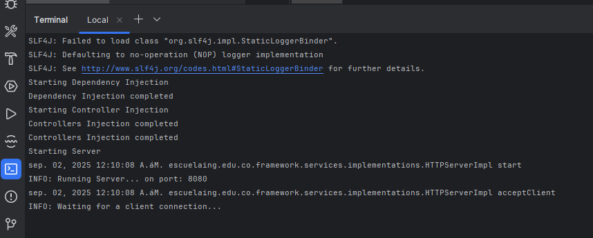
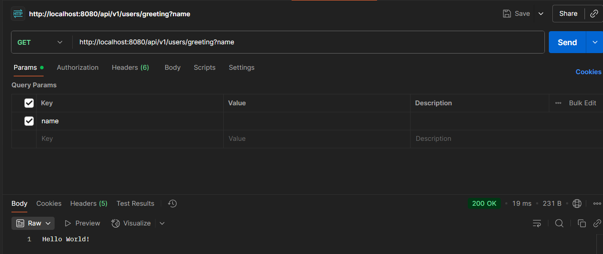
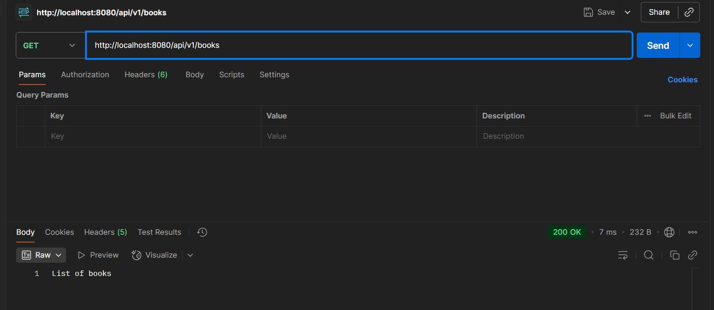
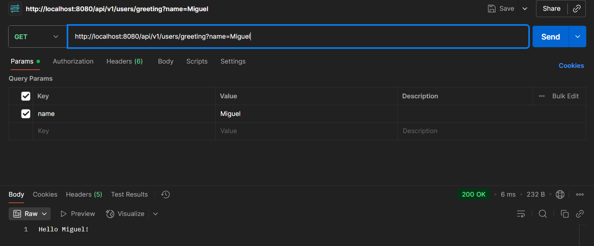
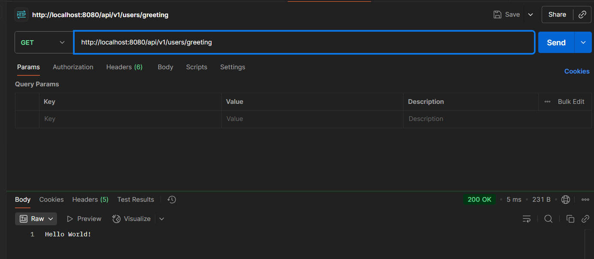
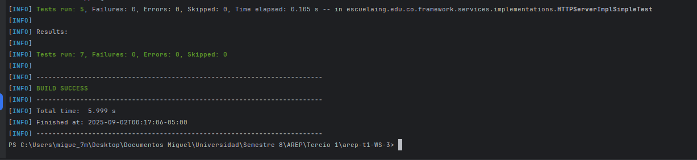

# Microframework Workshop - Dependency Injection & HTTP Server

### [Miguel Angel Motta Urrea](https://github.com/MIGUEL-MOTTA-U)
### 25/01/2025

## Contents
- [Objective](#objective)
- [Requirements](#requirements)
- [Setup](#setup)
- [Running the Framework](#running-the-framework)
- [Testing the Framework](#testing-the-framework)
- [Automated Tests](#automated-tests)
- [Conclusión](#conclusion)

## Objective
Este proyecto extiende un servidor web existente transformándolo en un microframework completo con inyección de dependencias e integración de servicios REST. El framework permite a los desarrolladores crear aplicaciones web usando anotaciones para definir controladores, componentes e inyección de dependencias, similar a frameworks como Spring Boot pero en una implementación más ligera.

### Funcionalidades principales:
1) **Inyección de Dependencias**: Sistema completo de IoC (Inversion of Control) con anotaciones `@Component` y `@Autowired`
2) **Controladores REST**: Definición de servicios REST usando `@RestController` y `@GetMapping`
3) **Parámetros de consulta**: Manejo automático de parámetros usando `@RequestParam`
4) **Archivos estáticos**: Servicio de archivos estáticos configurable
5) **Validación de rutas**: Sistema robusto de validación de paths
6) **Patrón Singleton**: Gestión centralizada de la aplicación

## Requirements

* Java 17 o superior
* Maven 3.6.0 o superior
* Git
* Un editor de texto o IDE (e.g., NetBeans, IntelliJ IDEA, VSCode)

## Setup
1. Clona el repositorio en tu máquina local:
```shell
git clone https://github.com/MIGUEL-MOTTA-U/arep-t1-WS-3.git
```
1. Navega al directorio del proyecto:
```shell
cd arep-t1-WS-3
```
2. Construye el proyecto usando Maven:
```shell
mvn clean install
```

## Running the Framework
Comando para ejecutar el servidor desde consola:
```shell
java -jar target/arep-t1-WS-3-1.0-SNAPSHOT.jar
```


La respuesta del servidor al acceder a `http://localhost:8080/api/v1/users/greeting?name` (porque no se 
envía el parámetro de name, el default es "World"):



### Testing the Framework
Ejemplo de controlador con anotaciones REST:
```java
package escuelaing.edu.co.src.dev;

import escuelaing.edu.co.framework.annotations.GetMapping;
import escuelaing.edu.co.framework.annotations.RestController;

@RestController("/api/v1")
public class BooksController {
    @GetMapping("/books")
    public String getBooks() {
        return "List of books";
    }
}
```

Al acceder a `http://localhost:8080/api/v1/books`, la respuesta será:



Ejemplo de controlador con parámetros de consulta:
```java
package escuelaing.edu.co.src.dev;

import escuelaing.edu.co.framework.annotations.GetMapping;
import escuelaing.edu.co.framework.annotations.RequestParam;
import escuelaing.edu.co.framework.annotations.RestController;

@RestController("/api/v1")
public class UserController {
    @GetMapping("/users/greeting")
    public String getUserById(@RequestParam(value = "name", defaultValue = "World") String name) {
        return "Hello " + name + "!";
    }
}
```

Al acceder a `http://localhost:8080/api/v1/users/greeting?name=Miguel`, la respuesta será:



En caso de no enviar el parámetro `name`, la respuesta será "Hello World!". Dado que por defecto el valor es "World".:



### Automated Tests

Para correr las pruebas automatizadas, usa el siguiente comando Maven:
```shell
mvn test
```




### Conclusion
Este proyecto demuestra cómo construir un microframework web ligero en Java con características 
modernas como inyección de dependencias y servicios REST. El uso de anotaciones simplifica la 
definición de controladores y la gestión de dependencias, facilitando el desarrollo de aplicaciones 
web. El framework es extensible y puede adaptarse a diversas necesidades de desarrollo web.

Aunque aún hay áreas para mejorar, como la gestión de errores y la documentación, este proyecto sienta
las bases para un microframework funcional y fácil de usar.