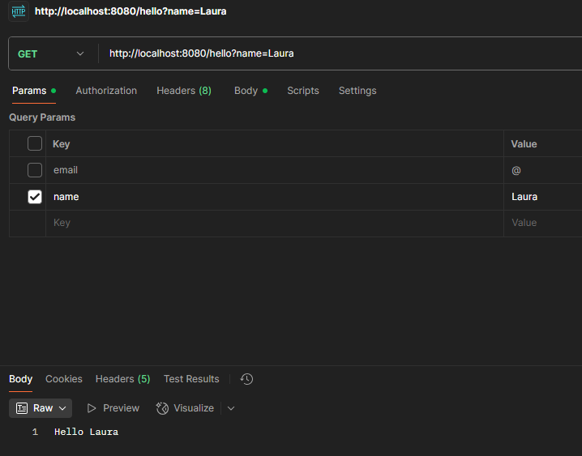

# Microframework Workshop - HTTP Server

### [Miguel Angel Motta Urrea](https://github.com/MIGUEL-MOTTA-U)
### 25/08/2025

## Contents
- [Objective](#objective)
- [Requirements](#requirements)
- [Setup](#setup)
- [Running the Server](#running-the-server)
- [Testing the Server](#testing-the-server)
- [Automated Tests](#automated-tests)
- [Conclusion](#conclusion)

## Objective
This project aims to enhance an existing web server, which 
currently supports HTML files, JavaScript, CSS, and images, 
by converting it into a fully functional web framework. 
This framework will enable the development of web applications 
with backend REST services. The new framework will provide 
developers with tools to define REST services using lambda 
functions, manage query values within requests, and specify the 
location of static files.

### Deliverables:
1) Implement a `get()` method that allows developers to define REST services using lambda functions.
2) Develop a mechanism to extract query parameters from incoming requests and make them accessible within the REST services.
3) Introduce a `staticfiles()` method that allows developers to define the folder where static files are located.
4) Meets all other functional requirements
5) Meets quality attributes
6) System design seems reasonable for the problem
7) Has automated tests

## Requirements

* Java 11 or higher
* Maven 3.6.0 or higher
* Git
* A text editor or IDE (e.g., NetBeans, IntelliJ IDEA, VSCode)

## Setup
1. Clone the repository to your local machine. (Make sure you have Git installed)
```shell
git clone https://github.com/MIGUEL-MOTTA-U/arep-t1-WS-2.git
```

2. Navigate to the project directory:
```shell
cd arep-t1-WS-2
```

3. Build the project using Maven:
```shell
mvn clean package
```

## Running the Server


### Command to run the server from console:
```shell
java -jar target/arep-t1-WS-2-1.0-SNAPSHOT.jar
```


### Run the server from an IDE:


## Testing the Server
We can test the server using a web browser or tools like Postman or curl.

### Requesting lambda defined route
First we can test the first route defined in the main method:
```java
package escuelaing.edu.co;
import static escuelaing.edu.co.framework.services.implementations.HTTPServerImpl.*;
public class Main {
    public static void main(String[] args) {
        get("/health", (request, response) -> {
            response.setStatus(200);
            response.setBody("The Server is working correctly!");
            return response;
        });
        //... other routes
        start(8080);
    }
}
```


### Requesting route with query parameters
Now we can test the second route defined in the main method that uses query parameters:
```java
package escuelaing.edu.co;
import static escuelaing.edu.co.framework.services.implementations.HTTPServerImpl.*;
public class Main {
    public static void main(String[] args) {
        get("/hello", (request, response) -> {
            response.setBody("Hello " + request.getValue("name"));
            return response;
        });
        start(8080);
    }
}
```




### Requesting static files

Then we can test the static files route defined in the main method
(For safety, the static files are located in `src/main/resources/webroot` folder):
```java
package escuelaing.edu.co;
import static escuelaing.edu.co.framework.services.implementations.HTTPServerImpl.*;
public class Main {
    public static void main(String[] args) {
        staticFiles("/webroot");
        start(8080);
    }
}
```
### Requesting an existing file from /webroot path


### Requesting an existing file from /webroot/api path 
> This `api` is not working as documentation anymore, it is just a folder inside webroot.
> To make it work as documentation, we would need to implement a new route with lambda function.


### Automated Tests
Automated tests are included in the [`src/test/java`](src/test/java/escuelaing/edu/co/framework/services/implementations/HTTPServerImplTest.java) directory.

To run the tests, use the following Maven command:
```shell
mvn test
```


## Conclusion

This project successfully transforms a basic web server into a microframework capable of handling 
RESTful services, query parameters, and static file serving. 
The implementation meets the specified requirements and quality attributes, providing a solid 
foundation for web application development.

It still has room for improvement, such as adding more HTTP methods (POST, PUT, DELETE),
enhancing error handling, and improving performance for high-traffic scenarios.
